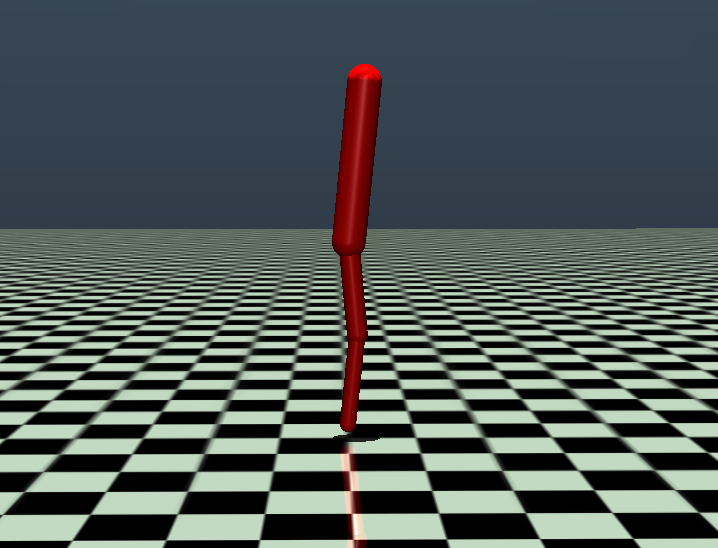

# Multi-Joint Model of Human Upright Stance

MuJoCo and Python implementation of the multi-joint model of human upright stance from the paper: [A multi-joint model of quiet, upright stance accounts for the uncontrolled manifold structure of joint variance", Hendrik Reimann, Gregor Schöner (2017)](https://link.springer.com/article/10.1007/s00422-017-0733-y)

<p align="center">

</p>

## Pre-requisites
* [MushroomRL](https://github.com/MushroomRL/mushroom-rl)
* [MuJoCo](https://github.com/deepmind/mujoco)
* [tqdm](https://github.com/tqdm/tqdm)

## Running the simulation
```
python3 human_stance_rs_controller.py
```


## Contributors
Alap Kshirsagar (TU Darmstadt), Raphael Schween (PU Marburg), Zeyuan Sun (TU Darmstadt), David Engel (PU Marburg)

Special thanks: Firas Al-Hafez (TU Darmstadt), Davide Tateo (TU Darmstadt), Hendrik Reimann (U Delaware)

The creation of this implementation was funded by grants awarded to Frank Bremmer, Jan Peters and Dominik Endres within the cluster project “The Adaptive Mind”, funded by the Excellence Program of the Hessian Ministry of Higher Education, Science, Research and Art.

## Citation
If you use this implementation for published research, please cite:
```
@article{reimann2017multi,
  title={A multi-joint model of quiet, upright stance accounts for the “uncontrolled manifold” structure of joint variance},
  author={Reimann, Hendrik and Sch{\"o}ner, Gregor},
  journal={Biological Cybernetics},
  volume={111},
  pages={389--403},
  year={2017},
  publisher={Springer}
}
```
